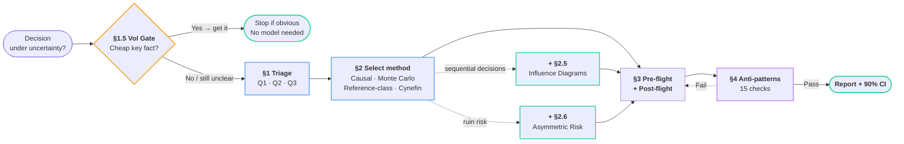

While trying to take a consequential decision, I ended up forgetting that the events that resulted in the decision were not independent. I realised it, while attending an introductory lecture about causal inference. LLMs are bad at the same thing: inferring relationships on the fly, but are good at making the building blocks (DAGs) when explicitly instructed to do so. To avoid making such mistakes in the future, I wanted a generalised prompt. This is v1.5 of that prompt.

---

> Drop this file into any project. It is the instruction set for the LLM
> (and for you) when modeling a decision under uncertainty. For the
> underlying research, books, and source citations, see the companion file
> `decision-framework-references.md`.

---

## Prompt flow

*Two views of the same process — scan the summary first, then expand the full detail.*

**Summary**



**Full detail**

```mermaid
flowchart TD
    Start(["`**Decision under uncertainty?**`"]) --> VoI

    VoI{"`**§1.5 VoI Gate**
Cheap key fact — or one-line
analytic bound — that would
make this obvious?`"}
    VoI -->|"Yes → get it"| VoIR["`Get it · Update priors
Re-evaluate`"]
    VoIR -->|"Decision obvious"| Done(["`Stop
No model needed`"])
    VoIR -->|"Still unclear"| Q1
    VoI -->|"No"| Q1

    Q1{"`**Q1**
Observational data
on past instances?`"}
    Q1 -->|Yes| M21
    Q1 -->|No| Q2

    Q2{"`**Q2**
Calibrated 90% CIs
for each input?`"}
    Q2 -->|Yes| M22
    Q2 -->|No| Q3

    Q3{"`**Q3**
Reference class of
comparable decisions?`"}
    Q3 -->|Yes| M23
    Q3 -->|No| M24

    M21["`**§2.1 Causal Inference**
DAG → testable implications
→ identification → estimation
*dagitty · dowhy · EconML*`"]

    M22["`**§2.2 Monte Carlo**
Tail-class check — name the mechanism
Heavy tail → exceedance form P(X > x)
Calibrated CIs + joint sampling
10 000+ draws · sensitivity analysis
*numpy · pymc · Guesstimate*`"]

    M23["`**§2.3 Reference-class**
Identify class → base-rate distribution
→ conservative inside-view adjustment
Pre-commit adjustment magnitude`"]

    M24["`**§2.4 Cynefin meta-routing**
Clear → categorise → respond
Complicated → analyse → respond
Complex → probe → sense → respond
Chaotic → act → sense → respond`"]

    M21 & M22 & M23 & M24 --> OC1

    OC1{"`Multiple sequential
decisions?`"}
    OC1 -->|Yes, also add| M25
    OC1 -->|No| OC2
    M25 --> OC2

    M25["`**§2.5 Influence Diagrams**
Decision □ · Chance ○ · Value ◇
Explicit dependence arrows
Node budget ≤8
*pgmpy · GeNIe · Analytica*`"]

    OC2{"`Downside is
irreversible or ruin?`"}
    OC2 -->|Yes, also add| M26
    OC2 -->|No| PF
    M26 --> PF

    M26["`**§2.6 Asymmetric Risk**
Maximise EV subject to P(ruin) < ε
Kelly criterion for repeated bets
Prefer optionality over closed choices
Exposure scaling — LLN or one-big-jump?`"]

    subgraph PrePost["§3 — Pre-flight + Post-flight  (run regardless of §2 method)"]
        PF["`**Pre-flight**
· Decision statement — one sentence
· Reversibility — if Low → §2.6
· Time horizon
· §1.5 target — get it if you can name it`"]
        EX["`**Execute §2 method**`"]
        POF["`**Post-flight**
· Run §4 anti-patterns
· Name the load-bearing assumption
· State what would flip the recommendation
· Retrospective — was key fact cheaply measurable?`"]
        PF --> EX --> POF
        POF -.->|revise if mis-specified| PF
    end

    POF --> Anti

    Anti["`**§4 Anti-patterns Checklist**
☐ Independence — stages truly independent?
☐ Marginal-vs-conditional — P(Y | upstream)?
☐ Hidden mediator — unrepresented variable?
☐ Missing category — implicit 'other' bucket?
☐ Point-estimate — 90% CIs belong here?
☐ Unit stability — constant-cost unit or state-dependent?
☐ Tail-class — named mechanism for distribution shape?
☐ Ruin — worst case survivable?
☐ LLM reliability — causal? Bayesian update? Sycophancy?
☐ Sensitivity — which ±50% assumption flips answer?
☐ Narrative direction — reversed arrow equally plausible?
☐ Reference-class — how does estimate differ from base rate?
☐ Sign vs magnitude — 2–10× error possible?
☐ VoI retrospective — load-bearing fact cheaply measurable?`"]

    Anti -->|All pass| Report
    Anti -->|Any fail| Fix

    Fix["`Fix mis-specification
Return to relevant §2 step`"] --> EX

    Report(["`**Report**
Answer with 90% CI
Load-bearing assumption
Range across plausible alternatives
What would most change the answer?`"])

    classDef question stroke:#f59e0b,stroke-width:2px
    classDef method stroke:#60a5fa,stroke-width:2px
    classDef overlay stroke:#34d399,stroke-width:2px
    classDef terminal stroke:#34d399,stroke-width:2px
    classDef check stroke:#c084fc,stroke-width:2px
    classDef voi stroke:#f59e0b,stroke-width:2px

    class Q1,Q2,Q3,OC1,OC2 question
    class M21,M22,M23,M24 method
    class M25,M26 overlay
    class Anti,Fix check
    class Report,Done terminal
    class VoI,VoIR voi
```



---

## 0. The structural rule

Multiplying marginal probabilities across stages assumes independence. If
the stages are causally connected — earlier outcomes shape later
distributions — that multiplication produces the wrong answer.

Before any modeling, ask:

> Are these stages really independent, or am I assuming independence
> because it makes the math easier?

If "I'm assuming," the right method is §2.2, §2.5, or §2.6 — not a flat
decision tree.

---

## 1. Triage — three questions

**Q1.** Do I have observational data on past instances of this decision?
- Yes → §2.1
- No → Q2

**Q2.** Can I specify calibrated 90% confidence intervals for each input?
- Yes → §2.2
- No → Q3

**Q3.** Is there a reference class of comparable past decisions?
- Yes → §2.3
- No → §2.4 (complex / chaotic; experiment rather than model)

Add §2.5 (influence diagram) if there are multiple sequential decisions.
Add §2.6 (asymmetric risk) if the downside is ruin.

---

## 1.5. Value of information gate

Before building any model, ask:

1. What single piece of information would most narrow the widest input
   distribution?
2. Can I obtain it in <48 hours for <₹5000 (or equivalent low cost)?
   - **Yes** → obtain it first. Update priors. Then model.
   - **No** → proceed to §2 with current priors, but flag the variable
     as "cheaply reducible" in the report.

This step exists because a 30-minute phone call often beats a 3-hour
simulation. If you can name the person who would know the answer, call
them before opening a spreadsheet. The same goes for arithmetic: a
one-line analytic bound (e.g. an exceedance estimate, `n · P(X > B)`)
can often settle whether a risk is negligible or dominant before any
simulation is built — a back-of-envelope calculation is a cheap fact
too.

**Examples:**
- Career comp decision → call two people who made the same move in the
  last 12 months. Their data points collapse a triangular(18, 25, 38)
  range to something much tighter.
- Product launch → run a 50-person survey before building a demand model.
- Investment → check if the historical return distribution already exists
  in FRED or Vanguard data before estimating it yourself.
- Budget overrun risk → a two-line exceedance calculation may show the
  tail probability is either negligible or dominant; no Monte Carlo
  needed either way.

If §1.5 produces a data point that makes the decision obvious, skip §2
entirely. Not every decision needs a model.

---

## 2. Methods catalog

### 2.1. Causal inference

**When:** Observational data exists; the question is "what happens if I
intervene on X?"

**Workflow:** DAG → testable implications (conditional independencies) →
identification (find adjustment set; verify query is answerable) →
estimation.

**Tools:** R: `dagitty`. Python: `dowhy`, `EconML`, `DoubleML`.

**Warning:** LLMs cannot perform causal inference. They can draft DAGs
and identify candidate confounders; the math must be done by a solver.

---

### 2.2. Monte Carlo with calibrated estimates

**When:** No large dataset; the decision is one-off; you can give 90%
confidence intervals for each unknown. Default for personal and strategic
decisions.

**Workflow:**

1. Frame the decision as a measurable choice.
2. Decompose into input variables. For each variable, ask whether it is
   independent of the others. If not, specify the dependence.
3. Calibrate each variable as a 90% CI. Practice calibration (your
   stated 90% intervals should contain truth ~90% of the time).
4. Run a Monte Carlo simulation (10,000+ draws) from the **joint**
   distribution. If variables are correlated, sample them together,
   not independently.
5. Run sensitivity analysis. Which variable contributes most to output
   variance? Measure that one harder before deciding.

**Tail-class check (before step 3):** a 90% CI is the wrong
representation for a fat-tailed variable — the decision-relevant
probability mass lives *outside* any 90% interval, and a triangular or
normal fit to a power-law variable understates exceedance by orders of
magnitude. You can be perfectly calibrated on the interval and still be
catastrophically wrong about the tail. Before assigning a CI, ask what
**mechanism** generates the variable: additive independent causes
suggest thin tails; multiplicative or feedback processes (compounding
state, viral dynamics, agentic loops) suggest heavy ones. If heavy,
model the exceedance function `P(X > x)` directly instead of the
interval, and route the decision through §2.6. Rule: **every
distributional assumption needs a named generative mechanism, or it's
decoration** — a fitted shape with no mechanism is exactly what the §4
LLM reliability check should distrust.

**Tools:** Python (`numpy`, `scipy.stats`, `pymc`), Excel + `@Risk`,
Stan, Guesstimate.

---

### 2.3. Reference-class forecasting

**When:** The decision feels novel to you but is structurally similar
to a class of past decisions someone has tracked.

**Workflow:**

1. Identify the reference class. Resist defining it too narrowly to feel
   unique.
2. Get the base-rate distribution (median, quartiles, tail).
3. Adjust for specifics, conservatively. Inside-view estimates diverging
   from base rates by more than ~30% are usually overconfident.
4. Pre-commit to the adjustment magnitude *before* doing the inside-view
   analysis.

#### 2.3.1. Where to find base rates

| Decision type | Sources |
|---|---|
| Career / comp | levels.fyi, Glassdoor, your own network (3 data points from people who made the same move in the last 12 months) |
| Startup | YC batch outcomes, Crunchbase survival rates, PitchBook |
| Investment | DALBAR, Vanguard long-term return data, FRED |
| Health | Cochrane reviews, UpToDate, NHS evidence summaries |
| Forecasting | Metaculus (calibrated crowd forecasts), Our World in Data |
| India-specific tech | levels.fyi India, TeamBlind salary threads, NASSCOM reports |

If you can't find a base rate in 20 minutes, you're either defining the
reference class too narrowly (make it broader) or the problem is
genuinely novel (switch to §2.2).

---

### 2.4. Cynefin meta-routing

**When:** You don't yet know what kind of problem you face.

| Domain | Cause-effect | Response | §2 method |
|---|---|---|---|
| Clear | Obvious | Sense → categorize → respond | No model needed. Apply best practice. |
| Complicated | Knowable with analysis | Sense → analyze → respond | §2.1 (data exists) or §2.3 (reference class exists) |
| Complex | Visible only in retrospect | Probe → sense → respond | §2.2 (simulate) + §2.5 (map dependencies) |
| Chaotic | Absent | Act → sense → respond (stabilize first) | Skip modeling. Stabilize, then re-triage. |
| Confused | Unknown | Decompose; route each piece | Break into sub-problems, re-triage each against §1. |

If you're unsure between Complicated and Complex, **default to Complex.**
The cost of over-modeling a Complicated problem is wasted time. The cost
of under-modeling a Complex problem is false confidence.

Cynefin tells you which §2 method is appropriate; it doesn't replace one.

---

### 2.5. Influence diagrams

**When:** The decision involves multiple sequential choices, multiple
dependent uncertainties, and you need to compute optimal policy — not
just expected value.

An influence diagram has three node types:
- **Decision nodes** (rectangles) — choices
- **Chance nodes** (ovals) — uncertain events
- **Value nodes** (diamonds) — utility

Dependence arrows are explicit. Flat decision trees collapse into
influence diagrams as soon as you accept stages are not independent.

**Node budget:** Start with ≤8 nodes. For each candidate node beyond 8,
run a quick mental test: "If I vary this node ±50%, does the recommended
path change in >10% of scenarios?" If no, the node is not load-bearing.
Drop it and mention it in prose as a known omission. A 12-node influence
diagram that you actually trace through beats a 30-node one that you
eyeball.

**Tools:** `pgmpy` (Python), GeNIe Modeler, Lumina Analytica.

---

### 2.6. Asymmetric-risk frameworks

**When:** The payoff distribution has fat tails, or the downside is
irreversible (ruin, reputational collapse, biological harm).

**Principles:**
- **Survival constraint:** maximize EV subject to `P(ruin) < ε`. Never
  optimize EV when a tail outcome is ruin.
- **Optionality:** prefer decisions that preserve future choices over
  those that close them off, even at lower EV.
- **Kelly criterion:** for repeated bets, allocate proportional to edge;
  never a fraction that causes ruin under realized variance.
- **Defensive deletion:** specify what you will *not* do; optimize within
  the survival set.
- **Exposure scaling:** if you repeat the decision n times, ask whether
  risk averages out or compounds. Thin tails → law of large numbers;
  risk per unit shrinks with repetition. Subexponential (heavy) tails →
  one-big-jump regime; `P(total loss exceeds budget) ≈ n · P(one draw
  exceeds budget)`, so risk scales *linearly* with exposure count
  instead of diluting. Job applications average out; parallel agents on
  a metered budget compound. Classify the regime before deciding how
  many times to play.

---

## 3. Pre-flight and post-flight

Run regardless of which §2 method you selected.

### Pre-flight (before building the model)

1. **Decision statement.** One sentence. What are you choosing between?
2. **Reversibility.** High / medium / low. If low, apply §2.6
   automatically.
3. **Time horizon.** ___ months. All outputs should be denominated in
   this horizon.
4. **What would make this decision obvious?** If you can name a specific
   fact or data point, that's your §1.5 target. Go get it before
   modeling.

### Post-flight (after running the model)

1. Run §4 (anti-patterns checklist).
2. Name the single load-bearing assumption.
3. State what new evidence would flip the recommendation.
4. **Retrospective check:** If the model took >2 hours and the
   load-bearing assumption is cheaply measurable, you built too early.
   Note this for next time.

---

## 4. Anti-patterns checklist

Run before reporting any answer.

- [ ] **Independence check.** If probabilities are multiplied across
  stages, are those stages truly independent? Any earlier outcome
  plausibly affecting a later probability → the model is mis-specified.
- [ ] **Marginal-vs-conditional check.** Each downstream probability
  should be `P(Y | upstream state)`, not the unconditional `P(Y)`.
- [ ] **Hidden mediator check.** Is there a variable that affects
  multiple stages but isn't represented?
- [ ] **Missing category check.** What is the implicit "other" bucket
  the model doesn't enumerate?
- [ ] **Point-estimate check.** Single numbers where 90% CIs belong?
- [ ] **Unit stability check.** Is the unit of decomposition actually
  constant-cost, or does its marginal cost/value vary with accumulated
  state? ("An hour of my time," "a task," "a user," "a token" — all can
  grow with state. A linear budget in a state-dependent unit is
  mis-specified from the start.)
- [ ] **Tail-class check.** For each variable, is there a named
  generative mechanism justifying its distribution shape? Additive
  causes → thin tails; multiplicative/feedback processes → heavy tails.
  If heavy, is the model in exceedance form (§2.2) and is exposure
  scaling accounted for (§2.6)? A fitted shape with no mechanism is
  decoration.
- [ ] **Stopping-rule check.** Payoffs capped at realistic terminals?
  Losses bounded by what is survivable?
- [ ] **LLM reliability check** (three sub-checks):
  - (a) Did the LLM estimate a causal effect `P(Y | do(X))` from its
    training distribution? That's associational. Use the LLM for
    structure; use math for the number.
  - (b) **Bayesian update check.** Did new evidence arrive
    mid-conversation? Verify the model re-propagated through ALL
    dependent variables, not just the nearest one. A local patch on one
    number while leaving correlated variables unchanged is not an update.
  - (c) **Sycophancy check.** Did the LLM change its answer after
    pushback without new evidence? If yes, revert to pre-pushback
    answer. See §9 pushback protocol.
- [ ] **Sensitivity check.** Which assumption, if changed ±50%, flips
  the recommendation? That's load-bearing; measure it harder.
- [ ] **Narrative direction check.** For the load-bearing causal edge,
  does the *reversed* arrow explain the same evidence equally well? If
  yes, the direction is an assumption, not a finding — label it as a
  prior and say what data would distinguish the two.
- [ ] **Reference-class check.** What do comparable past decisions
  show? How does my estimate differ, and why?
- [ ] **Ruin check.** Is the worst case survivable? If not, EV is the
  wrong objective.
- [ ] **Sign vs magnitude check.** Even if the model's sign is right,
  magnitude can be wrong by 2–10×. State uncertainty in the answer.
- [ ] **Value-of-information retrospective.** Could the load-bearing
  assumption have been measured directly for less effort than the model
  took? If yes, flag for next time.

---

## 5. 30-second flowchart

```
Decision under uncertainty?
├── No → solve directly.
└── Yes
    ├── §1.5: Can I cheaply get the one fact that
    │   would make this obvious?
    │   ├── Yes → get it. Re-evaluate. Maybe stop here.
    │   └── No → continue.
    └── Observational data on past instances?
        ├── Yes → §2.1 causal inference
        └── No → Calibrated 90% CIs available?
            ├── Yes → §2.2 Monte Carlo
            │   └── Multiple sequential decisions? → also §2.5
            └── No → Reference class exists?
                ├── Yes → §2.3
                └── No → §2.4 (experiment, don't model)

Downside is irreversible? → also §2.6.
Don't know what kind of problem this is? → §2.4 Cynefin routing.
```

---

## 6. Meta-prompt (use when tools are NOT available)

Paste alongside this file at the start of any decision-modeling session.

```
I have attached a decision framework file. Before responding, do the
following in order and show your work:

1. READ the file. Acknowledge §0.
2. VALUE OF INFORMATION (§1.5). Name the single cheapest data point
   that would most reduce uncertainty. If I can get it before
   modeling, tell me. If not, flag it and proceed.
3. TRIAGE my problem against §1. State the §2 method that applies and
   why. Commit before any analysis.
4. STATE ASSUMPTIONS with sources. For each conditional probability or
   causal arrow, name the evidence or label it as a prior.
5. CHECK DEPENDENCIES before multiplying probabilities. If variables
   are dependent, switch to a method that handles dependence (§2.2
   joint sampling, or §2.5 influence diagram).
6. EXECUTE the model. Show the computation. Produce a distribution,
   not a single number, when method permits.
7. RUN §4 anti-patterns before reporting. Walk through every checkbox.
8. REPORT honestly: answer with uncertainty, load-bearing assumption,
   range across plausible alternatives.
9. STOP if the question is unanswerable with information available.
   Tell me what would change the answer most.

Do not skip steps. Do not produce a number before §2. Do not multiply
marginal probabilities without §4. If you disagree with this prompt
because you think you already know the answer, that is a signal you are
on rung 1. Stop, route, retry.
```

---

## 7. LLM-augmented workflow (when tools ARE available)

Use this section when the LLM has web search and code execution
(e.g. Claude Pro / Sonnet 4+ on claude.ai, ChatGPT Pro with Code
Interpreter + Browsing). The empirical evidence for what tool-using
LLMs can and cannot do is summarized in the references file.

### 7.1. What to use the LLM for

- **DAG drafting.** Variable labels + domain context → draft DAG with
  rationale per edge. This is where LLMs add the most value.
- **Search-grounded base rates.** Every empirical input must come with
  a `web_search` and a cited source.
- **Code generation for math.** The LLM writes the simulation; an
  executor runs it. Never trust LLM arithmetic on conditional
  probabilities.
- **Adversarial review.** A second LLM pass runs the §4 checklist on
  the first pass's output.

### 7.2. What NOT to use the LLM for

- Computing `P(Y | do(X))` from training data. That's associational.
- Forecasting without retrieval. Frontier models without search are
  no better than uninformed guessing on current events.
- Final arithmetic on probabilities. Use code execution.
- Single-shot point estimates. Use ensembling (multiple prompts or
  re-runs, then median).

### 7.3. Failure modes specific to LLM workflows

- **Pattern-matching on familiar variables.** If the problem uses
  domain jargon the LLM "recognizes," test by renaming variables to
  nonsense words and checking the conclusion is the same.
- **Sycophancy under pressure.** Models flip causal judgments when
  users push back, even when the original judgment was correct. Do
  not argue an LLM into changing an answer. If you disagree, bring
  new evidence. See §9.
- **Search drift.** Web search returns can be stale or off-topic.
  Force the LLM to cite publication dates and filter for recency.
- **Confidence inflation.** Always ask for 90% CIs explicitly. Ranges
  narrower than 50% of the median should trigger skepticism.
- **Local patching instead of full update.** When new evidence arrives,
  LLMs tend to adjust the nearest number without re-propagating through
  dependent variables. After any mid-conversation evidence update,
  explicitly ask: "Which other variables should change given this new
  data?"

### 7.4. What's actually accessible in a chat interface

**Claude** (claude.ai or Pro): `web_search`, code execution (analysis
tool), file creation, artifacts, Projects (persist this file across
sessions), extended thinking (some versions). For ensembling: open
multiple chats independently with the same prompt; compare.

**ChatGPT** (Plus / Pro): Code Interpreter, web browsing, file upload,
Custom GPTs (you can configure one with this file as its instructions),
memory. For ensembling: same approach — separate conversations.

**Both:** the tool-use frameworks (LangChain, LangGraph, LiteLLM,
Metaculus's `forecasting-tools`) are *developer SDKs*, not chat-UI
features. If you are not writing Python, ignore them. They appear in
the references file for completeness, not as recommended tools for
chat workflows.

---

## 8. Augmented meta-prompt (use when tools ARE available)

Replaces §6 when web search + code execution are available.

```
You have access to web_search, code_execution, and (when applicable)
file tools. Use them. Do not answer from memory when search would
verify a claim. Do not perform arithmetic in prose when code would
compute it.

Follow this sequence:

1. READ the attached decision framework file. Acknowledge §0.

2. VALUE OF INFORMATION (§1.5). Before any modeling, name the
   cheapest data point that would most reduce uncertainty. If I should
   go get it first, say so and stop. If not, flag it and proceed.

3. TRIAGE against §1. Commit to a §2 method in writing before any
   analysis. If multiple methods apply, name all and justify the
   primary choice.

4. DRAFT THE DAG (if applicable). Propose edges with rationale per
   edge. Respect the node budget (≤8 to start; justify additions).
   Then list the conditional-independence implications. Ask me to
   confirm or refute each before continuing.

5. SEARCH for every empirical input. For each variable, run web_search
   and cite at least one source. Quote the publication date. If a
   recent number is not findable, state a range and label it a
   calibrated prior, not a fact.

6. ENSEMBLE on load-bearing estimates. Generate three independent
   estimates (vary prompt or framing); report median and range. If
   range exceeds 2× the median, flag the variable as poorly
   constrained.

7. WRITE CODE for the model. Use code_execution to run it. Show
   code, output, and a sanity check (probabilities sum to 1, no
   negative variance). Never compute conditional probabilities in
   prose.

8. SENSITIVITY ANALYSIS. Vary each load-bearing assumption ±50%.
   Identify the single most load-bearing one — that is what to
   measure harder.

9. RUN §4 ANTI-PATTERNS as a separate evaluator pass. Walk through
   every checkbox. Fix and return to the relevant step if any fail.

10. REPORT in order: answer with 90% CI; load-bearing assumption;
    range across reasonable alternatives; what additional information
    would most change the answer.

11. STOP if the question is unanswerable. Tell me what to measure.
    Do not produce a number to fill silence.

Pushback protocol: see §9. Do not flip answers under social pressure.

Tool budget: ≥3 web_searches before stating any rate or probability.
≥1 code_execution per numerical claim.
```

---

## 9. Pushback protocol

Governs what happens when the human disagrees with the model's output.
This section exists because sycophancy under pressure is a documented
LLM failure mode (see §7.3), and unstructured disagreement degrades
model outputs.

**For the LLM:**

When the human pushes back on your conclusion:

1. Ask: "Is this based on new evidence, or a disagreement with my
   reasoning?"
2. **If new evidence** → ask them to state it explicitly. Update the
   model: re-run the relevant §2 method with the new input,
   re-propagate through all dependent variables (§4 Bayesian update
   check), and show what changed in the output.
3. **If disagreement without new evidence** → restate your reasoning.
   Do NOT change the conclusion. Ask which specific assumption they
   dispute, and what data would resolve the dispute.
4. **If the human says "just do what I asked"** → comply, but flag:
   "Original recommendation unchanged. Proceeding with your override.
   The load-bearing disagreement is [X]."

**For the human:**

If you find yourself pushing back on the model's output, pause and
ask yourself:

- Do I have information the model doesn't? → State it explicitly. This
  is how the model learns.
- Am I uncomfortable with the conclusion because it's wrong, or because
  I don't like it? → These feel identical from the inside. The test:
  can you name a specific assumption you think is wrong and what the
  right number would be? If not, the discomfort is probably emotional,
  not epistemic.
- Am I anchored on a prior belief? → Check §2.3. What does the
  reference class say?

---

## 10. Changelog

| Version | Date | Changes |
|---|---|---|
| 1.0 | — | Initial framework |
| 1.1 | — | Added §7, §8 (LLM workflow) |
| 1.2 | — | Refinements |
| 1.3 | May 2026 | Published version |
| 1.4 | June 2026 | Added §1.5 (value of information gate). Replaced §3 Pólya wrapper with Pre-flight/Post-flight. Added §9 pushback protocol. Expanded §4 anti-patterns with Bayesian update + sycophancy sub-checks + VoI retrospective. Added §2.3.1 base rates table. Added §2 method column to §2.4 Cynefin table. Added §2.5 node budget. Added §7.3 local patching failure mode. Updated both Mermaid DAGs. |
| 1.5 | June 2026 | Added three §4 checks: unit stability (is the unit of decomposition constant-cost?), tail-class (named generative mechanism per distribution; exceedance form for heavy tails), narrative direction (does the reversed causal arrow explain the evidence equally well?). Added §2.2 tail-class check before calibration. Added §2.6 exposure scaling principle (LLN vs one-big-jump regime). Added analytic bound as a cheap fact in §1.5. Updated both Mermaid DAGs. |
