```mermaid
flowchart TD
    Start(["`**Decision under uncertainty?**`"]) --> Q1

    Q1{"`**Q1**
Observational data
on past instances?`"}
    Q1 -->|Yes| M21
    Q1 -->|No| Q2

    Q2{"`**Q2**
Calibrated 90% CIs
for each input?`"}
    Q2 -->|Yes| M22
    Q2 -->|No| Q3

    Q3{"`**Q3**
Reference class of
comparable decisions?`"}
    Q3 -->|Yes| M23
    Q3 -->|No| M24

    M21["`**§2.1 Causal Inference**
DAG → testable implications
→ identification → estimation
*dagitty · dowhy · EconML*`"]

    M22["`**§2.2 Monte Carlo**
Calibrated CIs + joint sampling
10 000+ draws · sensitivity analysis
*numpy · pymc · Guesstimate*`"]

    M23["`**§2.3 Reference-class**
Identify class → base-rate distribution
→ conservative inside-view adjustment
Pre-commit adjustment magnitude`"]

    M24["`**§2.4 Cynefin meta-routing**
Clear → categorise → respond
Complicated → analyse → respond
Complex → probe → sense → respond
Chaotic → act → sense → respond`"]

    M21 & M22 & M23 & M24 --> OC1

    OC1{"`Multiple sequential
decisions?`"}
    OC1 -->|Yes, also add| M25
    OC1 -->|No| OC2
    M25 --> OC2

    M25["`**§2.5 Influence Diagrams**
Decision □ · Chance ○ · Value ◇
Explicit dependence arrows
*pgmpy · GeNIe · Analytica*`"]

    OC2{"`Downside is
irreversible or ruin?`"}
    OC2 -->|Yes, also add| M26
    OC2 -->|No| P1
    M26 --> P1

    M26["`**§2.6 Asymmetric Risk**
Maximise EV subject to P(ruin) < ε
Kelly criterion for repeated bets
Prefer optionality over closed choices`"]

    subgraph Polya["§3 — Pólya Wrapper  (run regardless of §2 method)"]
        P1["`**1. Understand**
State the decision in one sentence
Identify reversibility · time horizon
· success criteria`"]
        P2["`**2. Devise**
Run §1 triage · commit to §2 method
in writing before building`"]
        P3["`**3. Execute**
Build the model
Document every assumption with a
source, or label it a prior`"]
        P4["`**4. Look back**
Run §4 anti-patterns · stress-test
Identify the load-bearing assumption`"]
        P1 --> P2 --> P3 --> P4
        P4 -.->|revise if mis-specified| P1
    end

    P4 --> Anti

    Anti["`**§4 Anti-patterns Checklist**
☐ Independence — stages truly independent?
☐ Marginal-vs-conditional — P(Y | upstream)?
☐ Hidden mediator — unrepresented variable?
☐ Missing category — implicit 'other' bucket?
☐ Point-estimate — 90% CIs belong here?
☐ Ruin — worst case survivable?
☐ LLM-as-oracle — used LLM for causal P(Y|do(X))?
☐ Sensitivity — which ±50% assumption flips answer?
☐ Reference-class — how does estimate differ from base rate?`"]

    Anti -->|All pass| Report
    Anti -->|Any fail| Fix

    Fix["`Fix mis-specification
Return to relevant §2 step`"] --> P3

    Report(["`**Report**
Answer with 90% CI
Load-bearing assumption
Range across plausible alternatives
What would most change the answer?`"])

    classDef question fill:#fef3c7,stroke:#d97706,color:#1c1917
    classDef method fill:#eff6ff,stroke:#3b82f6,color:#1e3a5f
    classDef overlay fill:#f0fdf4,stroke:#22c55e,color:#14532d
    classDef terminal fill:#f0fdf4,stroke:#16a34a,color:#14532d,font-weight:bold
    classDef check fill:#fdf4ff,stroke:#a855f7,color:#3b0764

    class Q1,Q2,Q3,OC1,OC2 question
    class M21,M22,M23,M24 method
    class M25,M26 overlay
    class Anti,Fix check
    class Report terminal
```

Visual DAG of the prompt flow from [[2026-05-21-General-Problem-Solving-Template|General Problem Solving Template]]. Each node maps to a section in that file. Expand the diagram using the button in the top-right corner of the code block.

---

---

## Node legend

| Colour | Meaning |
|--------|---------|
| Yellow diamond | Triage question (§1) |
| Blue rectangle | Primary method (§2.1–2.4) |
| Green rectangle | Overlay method (§2.5–2.6) |
| Purple rectangle | Anti-patterns gate (§4) |
| Green stadium | Terminal: report |

## Key structural rules encoded in the DAG

1. **Q1 → Q2 → Q3 are sequential, not independent** — each is only reached if the prior answer is "No".
2. **Overlays are additive** — §2.5 and §2.6 sit on top of the primary method, not instead of it.
3. **The Pólya wrapper is mandatory** — every path from §2 must pass through §3 before reaching §4.
4. **§4 is a gate, not a formality** — failure loops back to Execute (P3), not to the start.
5. **The dashed revision arrow in §3** models the iterative nature of the framework; it is not the same as the §4 failure loop.
