While trying to take a big decision, I ended up forgetting that the events that resulted in the decision were not independent. I realised that while attending an introductory about how LLMs are bad at causal inference, but good at making the building blocks (DAGs) that aid in doing it. To avoid making such mistakes in the future, I want a generalised prompt. This is v1.3 of that prompt.
 
---

> Drop this file into any project. It is the instruction set for the LLM
> (and for you) when modeling a decision under uncertainty. For the
> underlying research, books, and source citations, see the companion file
> `decision-framework-references.md`.

---

## 0. The structural rule

**Multiplying marginal probabilities across stages assumes independence.**
If the stages are causally connected — earlier outcomes shape later
distributions — that multiplication produces the wrong answer.

Before any modeling, ask:

> Are these stages really independent, or am I assuming independence
> because it makes the math easier?

If "I'm assuming," the right method is §2.2, §2.5, or §2.6 — not a flat
decision tree.

---

## 1. Triage — three questions

**Q1. Do I have observational data on past instances of this decision?**
- Yes → §2.1
- No → Q2

**Q2. Can I specify calibrated 90% confidence intervals for each input?**
- Yes → §2.2
- No → Q3

**Q3. Is there a reference class of comparable past decisions?**
- Yes → §2.3
- No → §2.4 (complex / chaotic; experiment rather than model)

Add §2.5 (influence diagram) if there are multiple sequential decisions.
Add §2.6 (asymmetric risk) if the downside is ruin.

---

## 2. Methods catalog

### 2.1. Causal inference

**When:** Observational data exists; the question is "what happens if I
intervene on X?"

**Workflow:** DAG → testable implications (conditional independencies) →
identification (find adjustment set; verify query is answerable) →
estimation.

**Tools:** R: `dagitty`. Python: `dowhy`, `EconML`, `DoubleML`.

**Warning:** LLMs cannot perform causal inference. They can draft DAGs
and identify candidate confounders; the math must be done by a solver.

---

### 2.2. Monte Carlo with calibrated estimates

**When:** No large dataset; the decision is one-off; you can give 90%
confidence intervals for each unknown. **Default for personal and
strategic decisions.**

**Workflow:**

1. Frame the decision as a measurable choice.
2. Decompose into input variables. For each variable, ask whether it is
   independent of the others. If not, specify the dependence.
3. Calibrate each variable as a 90% CI. Practice calibration (your
   stated 90% intervals should contain truth ~90% of the time).
4. Run a Monte Carlo simulation (10,000+ draws) from the **joint**
   distribution. If variables are correlated, sample them together,
   not independently.
5. Run sensitivity analysis. Which variable contributes most to output
   variance? Measure that one harder before deciding.

**Tools:** Python (`numpy`, `scipy.stats`, `pymc`), Excel + `@Risk`,
Stan, Guesstimate.

---

### 2.3. Reference-class forecasting

**When:** The decision feels novel to you but is structurally similar
to a class of past decisions someone has tracked.

**Workflow:**

1. Identify the reference class. Resist defining it too narrowly to feel
   unique.
2. Get the base-rate distribution (median, quartiles, tail).
3. Adjust for specifics, conservatively. Inside-view estimates diverging
   from base rates by more than ~30% are usually overconfident.
4. Pre-commit to the adjustment magnitude *before* doing the inside-view
   analysis.

---

### 2.4. Cynefin meta-routing

**When:** You don't yet know what kind of problem you face.

| Domain | Cause-effect | Response |
|---|---|---|
| Clear | Obvious | Sense → categorize → respond |
| Complicated | Knowable with analysis | Sense → analyze → respond |
| Complex | Visible only in retrospect | Probe → sense → respond |
| Chaotic | Absent | Act → sense → respond (stabilize first) |
| Confused | Unknown | Decompose; route each piece |

Cynefin tells you which §2 method is appropriate; it doesn't replace one.

---

### 2.5. Influence diagrams

**When:** The decision involves multiple sequential choices, multiple
dependent uncertainties, and you need to compute optimal policy — not
just expected value.

An influence diagram has three node types:
- **Decision nodes** (rectangles) — choices
- **Chance nodes** (ovals) — uncertain events
- **Value nodes** (diamonds) — utility

Dependence arrows are explicit. Flat decision trees collapse into
influence diagrams as soon as you accept stages are not independent.

**Tools:** `pgmpy` (Python), GeNIe Modeler, Lumina Analytica.

---

### 2.6. Asymmetric-risk frameworks

**When:** The payoff distribution has fat tails, or the downside is
irreversible (ruin, reputational collapse, biological harm).

**Principles:**
- **Survival constraint:** maximize EV subject to `P(ruin) < ε`. Never
  optimize EV when a tail outcome is ruin.
- **Optionality:** prefer decisions that preserve future choices over
  those that close them off, even at lower EV.
- **Kelly criterion:** for repeated bets, allocate proportional to edge;
  never a fraction that causes ruin under realized variance.
- **Defensive deletion:** specify what you will *not* do; optimize within
  the survival set.

---

## 3. Polya wrapper

Run this loop regardless of which §2 method you selected.

1. **Understand.** State the decision in one sentence. Identify
   reversibility, time horizon, success criteria.
2. **Devise.** Run §1; commit to a §2 method in writing before building.
3. **Execute.** Build the model. Document every assumption with a
   source or label it as a prior.
4. **Look back.** Run §4. Stress-test. Identify the load-bearing
   assumption.

---

## 4. Anti-patterns checklist

Run before reporting any answer.

- [ ] **Independence check.** If probabilities are multiplied across
  stages, are those stages truly independent? Any earlier outcome
  plausibly affecting a later probability → the model is mis-specified.
- [ ] **Marginal-vs-conditional check.** Each downstream probability
  should be `P(Y | upstream state)`, not the unconditional `P(Y)`.
- [ ] **Hidden mediator check.** Is there a variable that affects
  multiple stages but isn't represented?
- [ ] **Missing category check.** What is the implicit "other" bucket
  the model doesn't enumerate?
- [ ] **Point-estimate check.** Single numbers where 90% CIs belong?
- [ ] **Stopping-rule check.** Payoffs capped at realistic terminals?
  Losses bounded by what is survivable?
- [ ] **LLM-as-oracle check.** Did a language model estimate a causal
  effect `P(Y | do(X))` from its training distribution? That's
  associational. Use the LLM for structure; use math for the number.
- [ ] **Sensitivity check.** Which assumption, if changed ±50%, flips
  the recommendation? That's load-bearing; measure it harder.
- [ ] **Reference-class check.** What do comparable past decisions
  show? How does my estimate differ, and why?
- [ ] **Ruin check.** Is the worst case survivable? If not, EV is the
  wrong objective.
- [ ] **Sign vs magnitude check.** Even if the model's sign is right,
  magnitude can be wrong by 2–10×. State uncertainty in the answer.

---

## 5. Prompt flow DAG

```mermaid
flowchart TD
    Start(["`**Decision under uncertainty?**`"]) --> Q1

    Q1{"`**Q1**
Observational data
on past instances?`"}
    Q1 -->|Yes| M21
    Q1 -->|No| Q2

    Q2{"`**Q2**
Calibrated 90% CIs
for each input?`"}
    Q2 -->|Yes| M22
    Q2 -->|No| Q3

    Q3{"`**Q3**
Reference class of
comparable decisions?`"}
    Q3 -->|Yes| M23
    Q3 -->|No| M24

    M21["`**§2.1 Causal Inference**
DAG → testable implications
→ identification → estimation
*dagitty · dowhy · EconML*`"]

    M22["`**§2.2 Monte Carlo**
Calibrated CIs + joint sampling
10 000+ draws · sensitivity analysis
*numpy · pymc · Guesstimate*`"]

    M23["`**§2.3 Reference-class**
Identify class → base-rate distribution
→ conservative inside-view adjustment
Pre-commit adjustment magnitude`"]

    M24["`**§2.4 Cynefin meta-routing**
Clear → categorise → respond
Complicated → analyse → respond
Complex → probe → sense → respond
Chaotic → act → sense → respond`"]

    M21 & M22 & M23 & M24 --> OC1

    OC1{"`Multiple sequential
decisions?`"}
    OC1 -->|Yes, also add| M25
    OC1 -->|No| OC2
    M25 --> OC2

    M25["`**§2.5 Influence Diagrams**
Decision □ · Chance ○ · Value ◇
Explicit dependence arrows
*pgmpy · GeNIe · Analytica*`"]

    OC2{"`Downside is
irreversible or ruin?`"}
    OC2 -->|Yes, also add| M26
    OC2 -->|No| P1
    M26 --> P1

    M26["`**§2.6 Asymmetric Risk**
Maximise EV subject to P(ruin) < ε
Kelly criterion for repeated bets
Prefer optionality over closed choices`"]

    subgraph Polya["§3 — Pólya Wrapper  (run regardless of §2 method)"]
        P1["`**1. Understand**
State the decision in one sentence
Identify reversibility · time horizon
· success criteria`"]
        P2["`**2. Devise**
Run §1 triage · commit to §2 method
in writing before building`"]
        P3["`**3. Execute**
Build the model
Document every assumption with a
source, or label it a prior`"]
        P4["`**4. Look back**
Run §4 anti-patterns · stress-test
Identify the load-bearing assumption`"]
        P1 --> P2 --> P3 --> P4
        P4 -.->|revise if mis-specified| P1
    end

    P4 --> Anti

    Anti["`**§4 Anti-patterns Checklist**
☐ Independence — stages truly independent?
☐ Marginal-vs-conditional — P(Y | upstream)?
☐ Hidden mediator — unrepresented variable?
☐ Missing category — implicit 'other' bucket?
☐ Point-estimate — 90% CIs belong here?
☐ Ruin — worst case survivable?
☐ LLM-as-oracle — used LLM for causal P(Y|do(X))?
☐ Sensitivity — which ±50% assumption flips answer?
☐ Reference-class — how does estimate differ from base rate?`"]

    Anti -->|All pass| Report
    Anti -->|Any fail| Fix

    Fix["`Fix mis-specification
Return to relevant §2 step`"] --> P3

    Report(["`**Report**
Answer with 90% CI
Load-bearing assumption
Range across plausible alternatives
What would most change the answer?`"])

    classDef question fill:#fef3c7,stroke:#d97706,color:#1c1917
    classDef method fill:#eff6ff,stroke:#3b82f6,color:#1e3a5f
    classDef overlay fill:#f0fdf4,stroke:#22c55e,color:#14532d
    classDef terminal fill:#f0fdf4,stroke:#16a34a,color:#14532d,font-weight:bold
    classDef check fill:#fdf4ff,stroke:#a855f7,color:#3b0764

    class Q1,Q2,Q3,OC1,OC2 question
    class M21,M22,M23,M24 method
    class M25,M26 overlay
    class Anti,Fix check
    class Report terminal
```



---

## 6. Meta-prompt (use when tools are NOT available)

Paste alongside this file at the start of any decision-modeling session.

```
I have attached a decision framework file. Before responding, do the
following in order and show your work:

1. READ the file. Acknowledge §0.
2. TRIAGE my problem against §1. State the §2 method that applies and
   why. Commit before any analysis.
3. STATE ASSUMPTIONS with sources. For each conditional probability or
   causal arrow, name the evidence or label it as a prior.
4. CHECK DEPENDENCIES before multiplying probabilities. If variables
   are dependent, switch to a method that handles dependence (§2.2
   joint sampling, or §2.5 influence diagram).
5. EXECUTE the model. Show the computation. Produce a distribution,
   not a single number, when method permits.
6. RUN §4 anti-patterns before reporting. Walk through every checkbox.
7. REPORT honestly: answer with uncertainty, load-bearing assumption,
   range across plausible alternatives.
8. STOP if the question is unanswerable with information available.
   Tell me what would change the answer most.

Do not skip steps. Do not produce a number before §2. Do not multiply
marginal probabilities without §4. If you disagree with this prompt
because you think you already know the answer, that is a signal you are
on rung 1. Stop, route, retry.
```

---

## 7. LLM-augmented workflow (when tools ARE available)

Use this section when the LLM has web search and code execution
(e.g. Claude Pro / Sonnet 4+ on claude.ai, ChatGPT Pro with Code
Interpreter + Browsing). The empirical evidence for what tool-using
LLMs can and cannot do is summarized in the references file.

### 7.1. What to use the LLM for

- **DAG drafting.** Variable labels + domain context → draft DAG with
  rationale per edge. This is where LLMs add the most value.
- **Search-grounded base rates.** Every empirical input must come with
  a web_search and a cited source.
- **Code generation for math.** The LLM writes the simulation; an
  executor runs it. Never trust LLM arithmetic on conditional
  probabilities.
- **Adversarial review.** A second LLM pass runs the §4 checklist on
  the first pass's output.

### 7.2. What NOT to use the LLM for

- Computing `P(Y | do(X))` from training data. That's associational.
- Forecasting without retrieval. Frontier models without search are
  no better than uninformed guessing on current events.
- Final arithmetic on probabilities. Use code execution.
- Single-shot point estimates. Use ensembling (multiple prompts or
  re-runs, then median).

### 7.3. Failure modes specific to LLM workflows

- **Pattern-matching on familiar variables.** If the problem uses
  domain jargon the LLM "recognizes," test by renaming variables to
  nonsense words and checking the conclusion is the same.
- **Sycophancy under pressure.** Models flip causal judgments when
  users push back, even when the original judgment was correct. Do
  not argue an LLM into changing an answer. If you disagree, bring
  new evidence.
- **Search drift.** Web search returns can be stale or off-topic.
  Force the LLM to cite publication dates and filter for recency.
- **Confidence inflation.** Always ask for 90% CIs explicitly. Ranges
  narrower than 50% of the median should trigger skepticism.

### 7.4. What's actually accessible in a chat interface

**Claude (claude.ai or Pro):** web_search, code execution (analysis
tool), file creation, artifacts, Projects (persist this file across
sessions), extended thinking (some versions). For ensembling: open
multiple chats independently with the same prompt; compare.

**ChatGPT (Plus / Pro):** Code Interpreter, web browsing, file upload,
Custom GPTs (you can configure one with this file as its instructions),
memory. For ensembling: same approach — separate conversations.

**Both:** the tool-use frameworks (LangChain, LangGraph, LiteLLM,
Metaculus's `forecasting-tools`) are *developer SDKs*, not chat-UI
features. If you are not writing Python, ignore them. They appear in
the references file for completeness, not as recommended tools for
chat workflows.

---

## 8. Augmented meta-prompt (use when tools ARE available)

Replaces §6 when web search + code execution are available.

```
You have access to web_search, code_execution, and (when applicable)
file tools. Use them. Do not answer from memory when search would
verify a claim. Do not perform arithmetic in prose when code would
compute it.

Follow this sequence:

1. READ the attached decision framework file. Acknowledge §0.

2. TRIAGE against §1. Commit to a §2 method in writing before any
   analysis. If multiple methods apply, name all and justify the
   primary choice.

3. DRAFT THE DAG (if applicable). Propose edges with rationale per
   edge. Then list the conditional-independence implications. Ask me
   to confirm or refute each before continuing.

4. SEARCH for every empirical input. For each variable, run web_search
   and cite at least one source. Quote the publication date. If a
   recent number is not findable, state a range and label it a
   calibrated prior, not a fact.

5. ENSEMBLE on load-bearing estimates. Generate three independent
   estimates (vary prompt or framing); report median and range. If
   range exceeds 2× the median, flag the variable as poorly
   constrained.

6. WRITE CODE for the model. Use code_execution to run it. Show
   code, output, and a sanity check (probabilities sum to 1, no
   negative variance). Never compute conditional probabilities in
   prose.

7. SENSITIVITY ANALYSIS. Vary each load-bearing assumption ±50%.
   Identify the single most load-bearing one — that is what to
   measure harder.

8. RUN §4 ANTI-PATTERNS as a separate evaluator pass. Walk through
   every checkbox. Fix and return to the relevant step if any fail.

9. REPORT in order: answer with 90% CI; load-bearing assumption;
   range across reasonable alternatives; what additional information
   would most change the answer.

10. STOP if the question is unanswerable. Tell me what to measure.
    Do not produce a number to fill silence.

Anti-sycophancy clause: if I push back without new evidence, do not
flip your answer. Restate your reasoning and ask what evidence I
have. Capitulation under pressure is the failure mode CLadder and
related work document.

Tool budget: ≥3 web_searches before stating any rate or probability.
≥1 code_execution per numerical claim.
```
