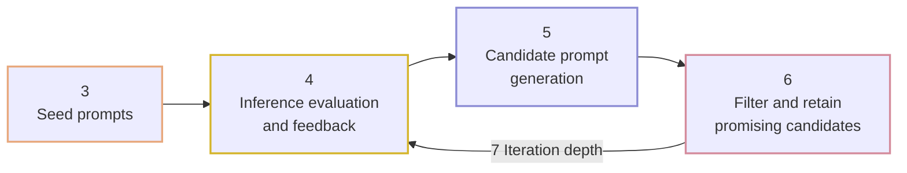
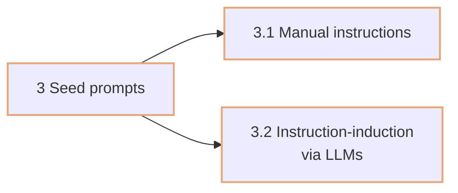
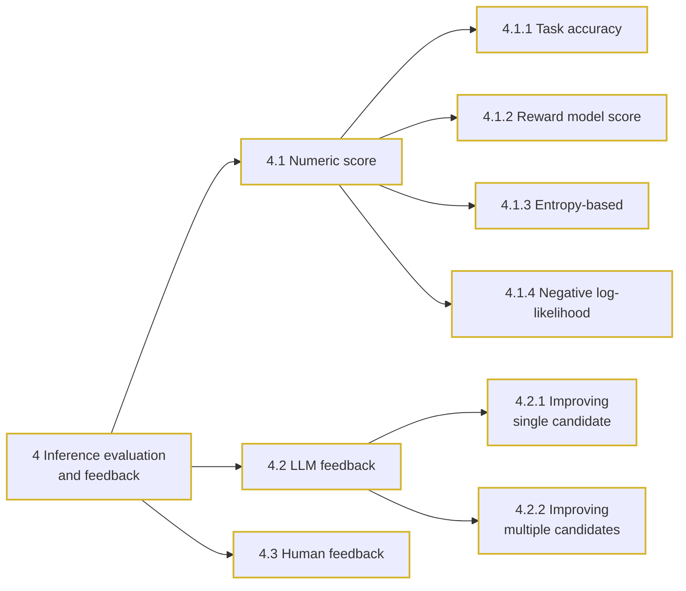
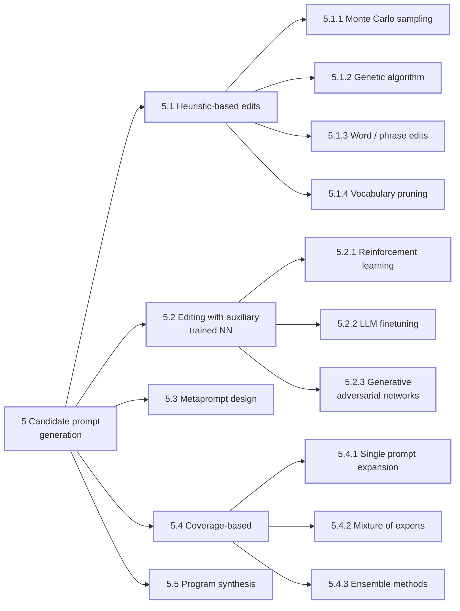
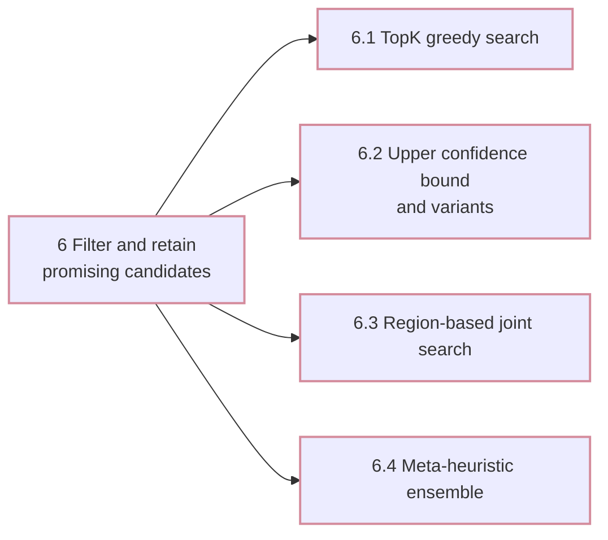
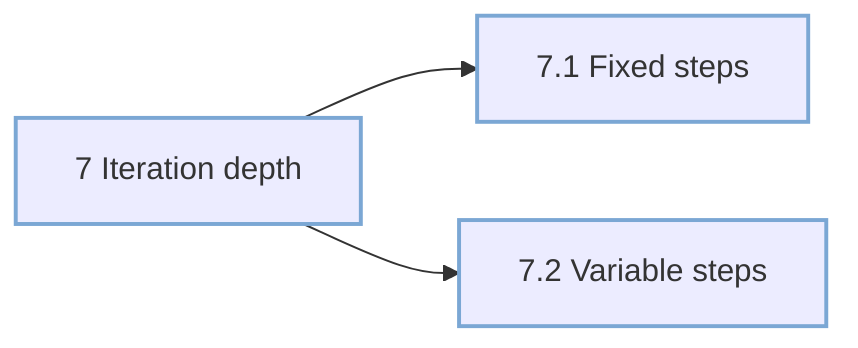

A redrawn version of Figure 1 from an EMNLP 2025 paper, which lays out the anatomy of an automatic prompt optimization system as five components. Section numbers below are the paper's own.

Source: [https://aclanthology.org/2025.emnlp-main.1681.pdf](https://aclanthology.org/2025.emnlp-main.1681.pdf)

## The five components

The figure itself is a flat tree rooted at "Prompt optimization anatomy, section 2". Read as a pipeline, the five branches sit in this order, with section 7 controlling how many times the middle three repeat.

## 3. Seed prompts

Where the starting prompt comes from.

## 4. Inference evaluation and feedback

How a candidate prompt is scored, and what signal is passed back to the generator.

## 5. Candidate prompt generation

How new candidate prompts are produced. The largest branch of the taxonomy.

## 6. Filter and retain promising candidates

The search strategy over the candidate pool.

## 7. Iteration depth

How the loop terminates.

